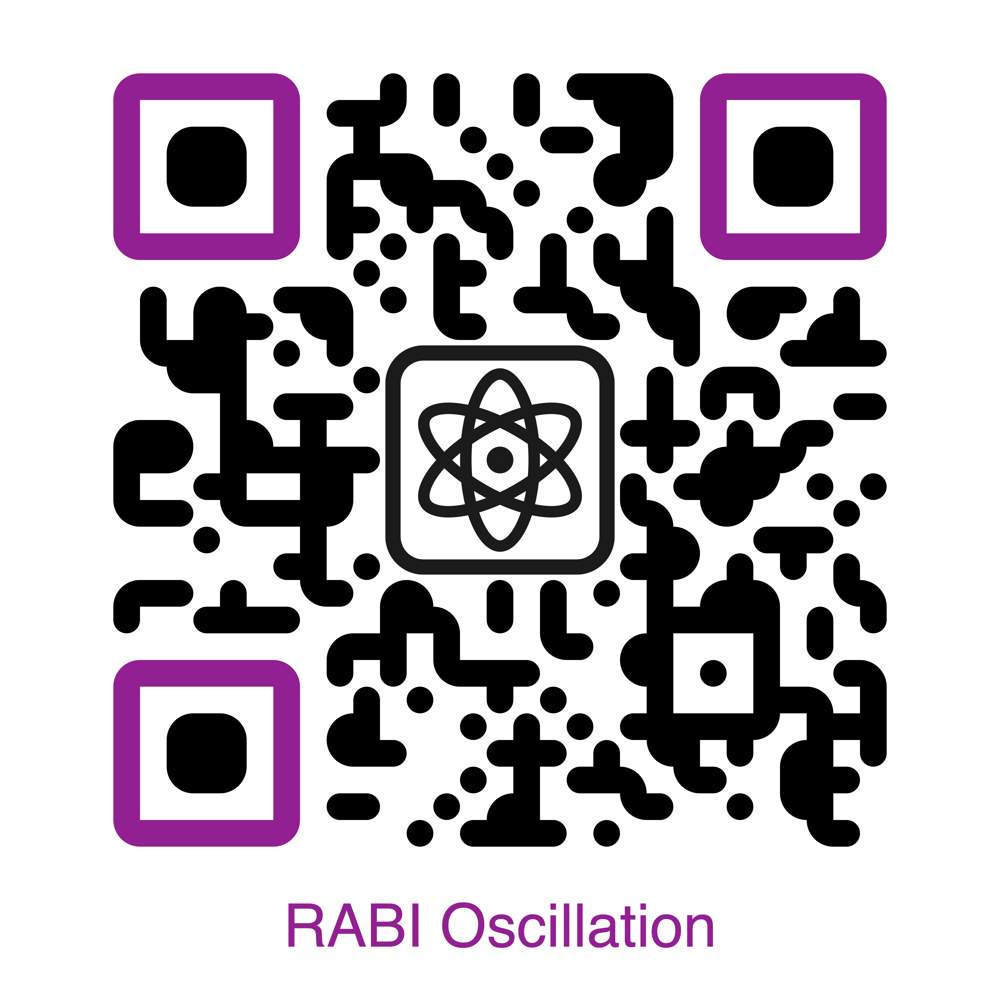
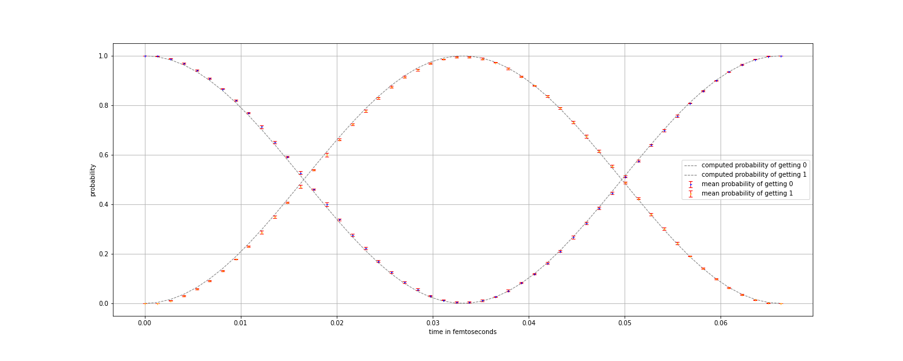

# RABI Oscillation

> project created during an Open Science internship

**Work of:** Kristina Prošková, Denisa Vítková & Berenika Zemanová   
**Mentor:** Subhroneel Chakrabarti   
**Place:** Physics Insitute, Czech Academy of Sciences   
**Update date:** 11/30/2022

## Aim of the Project

* Reproduce Rabi oscillation in an IBM quantum computer
* Capture how a qubit evolves under different Hamiltonians
* Analyse the effects of error and how to mitigate it

## Implementation and the runtime details

* We worked with these three Hamiltonians:

$$
H_{1}=\begin{pmatrix}
71 & 50i \\
-50i & 71
\end{pmatrix}
$$

$$
H_{2}=\begin{pmatrix}
3.2 & 0.14 \\
0.14 & 4.16
\end{pmatrix}
$$

$$
H_{3}=\begin{pmatrix}
5 & 3+2i \\
3-2i & 5
\end{pmatrix}
$$

* We used IBM Quantum Computer with 5 qubits named Manila
* Each circuit was ran for 8192 shots

## Project Outcomes

* We successfully reproduced Rabi oscillations in IBM-Q
* It shows good agreement with theoretical predictions prior to error mitigation
* After error mitigation the agreement is excellent


| System         | H1 Before Error Mitigation | H1 After Error Mitigation | H2 After Error Mitigation | H3 After Error Mitigation |
| :--            | :-:                        | :-:                       | :-:                       | :-:                       |
| __Mean Error__ | 6.244%                     | 1.061%                    | 0.417%                    | 0.519%                    |

<!---->

## Code Structure

```
RABI-Oscillation project tree
├─ CLASSES
│  ├─ EXP-noisy-simulator.ipynb
│  ├─ EXP-real-hardware.ipynb
│  ├─ EXP-theoretical-analyzis.ipynb
│  ├─ Experiment.ipynb
│  └─ Hamiltonian.ipynb
├─ EXPERIMENTS
├─ INPUT
│  └─ hamiltonians.csv
├─ OUTPUT
│  ├─ DATA
│  │  ├─ IBMQ
│  │  ├─ SIMULATOR
│  │  └─ THEORY
│  └─ PLOTS
│     ├─ IBMQ
│     ├─ SIMULATOR
│     └─ THEORY
├─ SETUP
│  ├─ backend.ipynb
│  ├─ functions.ipynb
│  ├─ init.ipynb
│  ├─ libraries.ipynb
│  ├─ load-hamiltonians.ipynb
│  └─ user-settings.ipynb
└─ README.md
```

<!--
## Code Structure

```
RABI oscillation project tree
├─ CLASSES
├─ EXPERIMENTS
├─ INPUT
│  └─ hamiltonians.csv
├─ OUTPUT
│  ├─ DATA
│  └─ PLOTS
├─ SETUP
│  ├─ backend.ipynb
│  ├─ functions.ipynb
│  ├─ init.ipynb
│  ├─ libraries.ipynb
│  ├─ load-hamiltonians.ipynb
│  └─ user-settings.ipynb
└─ README.md
```
-->
